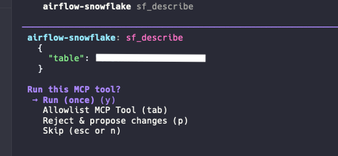
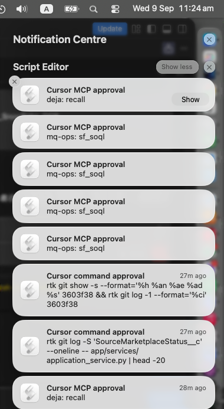
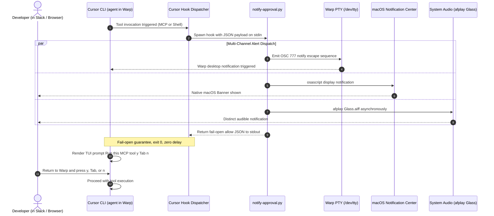

<p align="center">
  <a href="README.md"><b>English</b></a> | <a href="README_zh.md"><b>简体中文</b></a>
</p>

# Cursor CLI Pager: Production-Grade MCP & Shell Approval Notifier

<p align="center">
  <a href="https://github.com/CloudsDocker/cursor-cli-pager"></a>
  <a href="https://github.com/CloudsDocker/cursor-cli-pager/actions/workflows/ci.yml"></a>
  <a href="#-architecture--the-three-permission-planes"></a>
  <a href="hooks/notify-approval.py"></a>
  <a href="https://cursor.com/docs/hooks"></a>
  <a href="https://docs.warp.dev/"></a>
  <a href="LICENSE"></a>
</p>

<table align="center" width="100%">
  <tr>
    <th align="center" width="55%">🚨 The Problem: Silent TUI Stall in Warp</th>
    <th align="center" width="45%">🔔 The Solution: Instant macOS & Warp Paging</th>
  </tr>
  <tr>
    <td align="center" valign="top">
      
      <br/>
      <em><b>Silent Blocking Gate:</b> Cursor CLI agent halts indefinitely on <code>Run this MCP tool? (y/Tab/p/n)</code> while you are multitasking in Slack, browser, or IDE.</em>
    </td>
    <td align="center" valign="top">
      
      <br/>
      <em><b>Instant Pager:</b> Real-time macOS Notification Center banners + audible Glass chime + Warp PTY OSC 777 escape notifications alert you the instant an approval is needed.</em>
    </td>
  </tr>
</table>

A production-grade, zero-dependency, fail-open notification hook for **Cursor CLI (`agent`)** running in **Warp** and macOS terminal emulators. Alerts you via **macOS Notification Center**, **audible chime (`Glass`)**, and **Warp OSC 777** the exact second an autonomous agent halts on an MCP tool approval or shell confirmation gate.

---

## ⚡ TL;DR: Why This Repository Exists

When developers delegate complex tasks to autonomous CLI agents (such as Cursor CLI `agent`) inside modern terminal emulators like [Warp](https://www.warp.dev/), agents frequently invoke **Model Context Protocol (MCP)** tools (e.g., querying Snowflake, browsing schemas, executing Git actions) or destructive shell commands. When an unapproved tool is called, Cursor CLI displays an interactive approval gate:

```text
airflow-snowflake: sf_describe
{
  "table": "ODS.HRIS.EMPLOYEE"
}

Run this MCP tool?
-> Run (once) (y)
   Allowlist MCP Tool (tab)
   Reject & propose changes (p)
   Skip (esc or n)
```

If you switch focus to Slack, Chrome, or your code editor, **the agent sits completely stalled**. Minutes turn into hours.

### Why Existing Solutions Fail

1. **Warp Agent Notifications don't cover Cursor CLI**: Warp's [agent notifications](https://docs.warp.dev/agents/capabilities/agent-notifications/) only officially support Warp Agent, Claude Code (via plugin), Codex, and OpenCode. Cursor CLI is an uninstrumented third-party TUI process.
2. **Warp session notifications miss interactive TUIs**: Warp monitors process exits and standard `Password:` prompts on stdin. It does not parse Cursor's custom full-screen Ink TUI approval menu.
3. **Existing community hooks only trigger on `stop`**: Popular hooks (like `cursor-notify` or `agent-notify`) listen to the `stop` event (session completion). But stalled approval prompts happen **mid-turn**, long before any stop event ever fires!
4. **Hook `allow` does NOT bypass the prompt**: Cursor engineering confirmed that hook permissions and the MCP interactive allowlist are separate architectural planes. Hooks are designed as a **deny/observe filter**, not a prompt bypass.

**Cursor CLI Pager** bridges this exact gap: an observe-only, fail-open hook that triggers on `beforeMCPExecution` and `beforeShellExecution`, emits dual-channel alerts, and immediately returns `{"permission": "allow"}` so the interactive approval gate remains intact and security is never compromised.

---

## 🎯 Core Value Propositions & Engineering Invariants

| Engineering Pillar | What Cursor CLI Pager Delivers | Implementation & Invariant |
|---|---|---|
| 🛡️ **Zero Auto-Approve (Security-First)** | Strictly observe-only. Never auto-approves destructive MCP or shell tools. Human remains 100% in the loop. | [`hooks/notify-approval.py`](hooks/notify-approval.py) |
| 🔔 **Dual-Channel Alerting** | Simultaneous macOS Notification Center (`osascript` + `afplay Glass`) and Warp PTY terminal escape sequences (`OSC 777` / `OSC 9`). | [`hooks/notify-approval.py`](hooks/notify-approval.py) |
| ⚡ **Zero External Dependencies** | Written purely in standard Python 3 (`json`, `subprocess`, `os`). Installs in < 5 seconds without `pip`, `npm`, or `brew`. | [`install.sh`](install.sh) |
| 🛡️ **Fail-Open Protocol Guarantee** | Stdout is strictly restricted to `{"permission": "allow"}`. Crashes or unhandled exceptions never block the agent. | [`hooks/notify-approval.py`](hooks/notify-approval.py) |
| 🔒 **Zero Data Leakage** | Summarizes only server + tool names or sanitized command prefixes. Never leaks tool payloads or table secrets to notifications. | [`hooks/notify-approval.py`](hooks/notify-approval.py) |
| 🧠 **Three-Plane Architecture Awareness** | Respects the distinct separation between Cursor's MCP allowlist, hook execution engine, and terminal PTY emulator. | [`docs/02-deep-dive.md`](docs/02-deep-dive.md) |

---

## 🏛️ System Architecture & Execution Flow



---

## 🔍 The Three Permission Planes

When Cursor CLI prompts **Run this MCP tool?**, three independent systems are involved:

| Plane | Configuration Location | What It Actually Does |
|---|---|---|
| **1. MCP / Agent Allowlist** | Cursor Settings → Tools & MCP, Auto-review, `permissions.json` `mcpAllowlist`, CLI `permissions.allow` | Controls whether the **interactive TUI approval menu** appears on screen. |
| **2. Cursor Hooks** | `~/.cursor/hooks.json` (`beforeMCPExecution` / `beforeShellExecution`) | Spawns a sub-process with JSON I/O. Can **deny** or **observe**. Returning `allow` **does not skip** the interactive MCP prompt. |
| **3. Terminal Emulator** | Warp notifications, OSC 9/777, macOS Notification Center | Manages the PTY, processes, and desktop banners. Completely blind to Cursor's Ink TUI unless signaled via OSC or OS script. |

> [!NOTE]
> Cursor core team members have confirmed that hook responses (`allow` / `ask`) and the MCP allowlist are completely independent. Hooks exist as a policy enforcement/rejection gate, not a prompt bypass mechanism. See official discussions:
> - [Hooks return allow but MCP tool still requires manual approval](https://forum.cursor.com/t/hooks-return-allow-but-mcp-tool-still-requires-manual-approval-gets-skipped/155434)
> - [The cursor hooks did not execute as expected](https://forum.cursor.com/t/the-cursor-hooks-did-not-execute-as-expected/155711)

---

## 📊 Comparative Landscape: Where Cursor CLI Pager Fits

| Solution | Target Event | Covers MCP Approval? | Warp OSC 777? | macOS Banners? | Audible Alert? | Zero Dependencies? | License |
|---|---|:---:|:---:|:---:|:---:|:---:|:---:|
| **`cursor-cli-pager` (This Repo)** | `beforeMCPExecution` + `beforeShellExecution` | **Yes (Real-time)** | **Yes** | **Yes** | **Yes (Glass)** | **Yes (Pure Python)** | **MIT** |
| **Warp Native Agent Notifications** | Warp Agent / Claude / Codex | **No (Cursor unsupported)** | N/A | Yes | Warp default | N/A | Proprietary |
| **`cursor-attention-beep`** | `beforeMCPExecution` (opt-in) | Partial (Chatty) | No | Optional | Yes | Requires Node/brew | MIT |
| **`cursor-notify`** | `stop`, `sessionStart`, `postToolUseFailure` | **No (Turn-end only)** | No | Yes | No | Python | MIT |
| **`agent-notify`** | Multi-CLI `stop` / completion | **No (Cursor MCP missed)** | No | Yes | Optional | Python / Node | MIT |
| **AI Done Now / AgentNotch** | Menu bar / App polling | Yes | No | Yes | Yes | Closed source app | Commercial |

---

## 🚀 Quickstart

### 1. Automated Installation (Under 30 Seconds)

Clone the repository and run the automated installer:

```bash
git clone https://github.com/CloudsDocker/cursor-cli-pager.git
cd cursor-cli-pager
chmod +x install.sh
./install.sh
```

The installer will:
1. Copy `hooks/notify-approval.py` into `~/.cursor/hooks/notify-approval.py`.
2. Ensure executable permissions (`chmod +x`).
3. Safely merge `beforeMCPExecution` and `beforeShellExecution` events into `~/.cursor/hooks.json`.

### 2. Verify Notification Permissions

1. **macOS System Settings** → **Notifications** → Ensure **Warp** (and **Script Editor**, which delivers `osascript` banners) has alerts and sounds enabled.
2. **Warp Settings** → **Features** → **Session** → Turn on **Desktop notifications**.
3. **Turn off Focus / Do Not Disturb** while testing.

### 3. Validate with an Instant Dry-Run Test

You don't need to trigger a real MCP tool to verify notifications. Test the hook directly from your terminal:

```bash
python3 ~/.cursor/hooks/notify-approval.py <<'EOF'
{"hook_event_name":"beforeMCPExecution","mcp_server_name":"airflow-snowflake","tool_name":"sf_describe"}
EOF
```

**Expected Outcome:**
- **Terminal stdout**: Exactly `{"permission": "allow"}`
- **System Sound**: Audio chime (`Glass`)
- **macOS Banner**: Title: **Cursor MCP approval**, Body: **airflow-snowflake: sf_describe**

### 4. Real Workflow Verification

1. Start `agent` inside Warp.
2. Ask the agent to execute a task requiring an MCP tool that is not yet allowlisted.
3. Switch your focus to another application (Slack, Chrome, etc.).
4. When Cursor CLI displays **Run this MCP tool?**, you will immediately receive a desktop banner and chime.
5. Switch back to Warp and press `y` (once), `Tab` (allowlist), or `n` (skip).

### 5. Clean Uninstallation

If you ever wish to uninstall, run the included uninstall script:

```bash
chmod +x uninstall.sh
./uninstall.sh
```

---

## 🎛️ Noise Reduction & Operational Best Practices

`beforeMCPExecution` fires prior to every MCP invocation attempted by the agent, including tools you may have already allowlisted in your session.

### Best Practices to Keep Noise Low:

1. **Allowlist Trusted Read Tools**:
   In Cursor CLI, press `Tab` on trusted, read-only tools (e.g., `git_status`, `ripgrep`, `read_file`) to allowlist them for the session or project.
2. **Sanitize Notification Payloads (Zero Data Leakage)**:
   This hook intentionally extracts only `mcp_server_name` and `tool_name` (or truncated shell commands), never the parameters in `tool_input`. Sensitive database passwords, private keys, or table row records will **never** leak into notification banners or system logs.
3. **Fail-Open Resilience**:
   The hook wraps all I/O, OSC sequences, and OS notifications in safe try/except blocks. It **always** outputs `{"permission": "allow"}` and exits `0`. It will never crash or hang your agent's execution loop.

---

## 📂 Repository Structure

```
cursor-cli-pager/
├── .github/
│   └── workflows/
│       └── ci.yml             # Multi-OS (macOS/Ubuntu) & Python matrix CI
├── assets/
│   ├── mcp-approval-prompt.png # Visual: Cursor CLI MCP approval prompt gate
│   └── pager.png              # Visual: macOS Notification Center alert stack
├── docs/
│   ├── 01-setup-guide.md      # Detailed step-by-step setup & troubleshooting
│   ├── 02-deep-dive.md        # Architectural deep dive: hooks, PTY escapes & planes
│   └── related-work.md        # Deep competitive analysis & prior art survey
├── hooks/
│   └── notify-approval.py     # Pure Python stdlib hook (fail-open, zero-dep)
├── tests/
│   └── test_notify.py         # Offline test suite (JSON invariants & summarization)
├── hooks.json                 # Reference Cursor hook configuration schema
├── install.sh                 # One-click automated installer
├── uninstall.sh               # One-click clean uninstaller
├── pyproject.toml             # Modern Python project configuration
├── CONTRIBUTING.md            # Contribution guidelines & architectural invariants
├── LICENSE                    # MIT License
└── README.md                  # Flagship documentation (English)
```

---

## 🧪 Test Suite & Continuous Integration

This repository maintains 100% offline test coverage with zero network calls:

```bash
# Run unit tests
python3 -m unittest discover -s tests -v

# Validate Python bytecode compilation
python3 -m py_compile hooks/notify-approval.py tests/test_notify.py
```

All pushes and pull requests are validated across macOS and Ubuntu across Python 3.9 through 3.12 via [GitHub Actions](.github/workflows/ci.yml).

---

## 📚 Technical Documentation & Deep Dives

For engineering teams and interview preparation:

| Document | Topic | Description |
|---|---|---|
| 📖 [**Setup Guide**](docs/01-setup-guide.md) | Operations & Setup | Complete setup instructions, notification permissions, and troubleshooting tips. |
| 🔬 [**Deep Dive**](docs/02-deep-dive.md) | Architecture & Security | Detailed technical analysis of the 3 permission planes, PTY `/dev/tty` escape routing, and why naive hooks fail. |
| 🌐 [**Related Work**](docs/related-work.md) | Ecosystem Analysis | Comprehensive breakdown of 10+ open-source, commercial, and first-party notification tools. |

---

## 🤝 Architectural Invariants for Contributors

When submitting pull requests, please respect the three core architectural invariants:

1. **Observe-Only**: Never attempt to auto-approve tools or bypass human security confirmation.
2. **Pure Stdout**: Never print logs, debug messages, or OSC escape sequences to stdout. Stdout is reserved exclusively for the Cursor hook JSON response.
3. **Zero Dependencies**: Keep the hook strictly within the Python standard library. No `pip install`, Node.js, or external binaries required.

---

## 📄 License & Attribution

Distributed under the **MIT License**. See [`LICENSE`](LICENSE) for details.

Maintained by **Todd Zhang** ([@CloudsDocker](https://github.com/CloudsDocker)). Contributions, bug reports, and suggestions are welcome!
