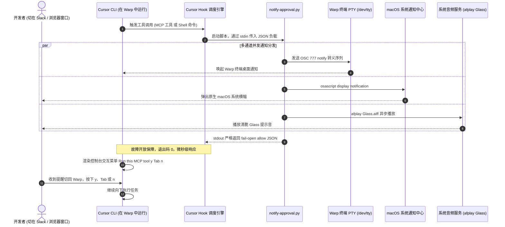

<p align="center">
  <a href="README.md"><b>English</b></a> | <a href="README_zh.md"><b>简体中文</b></a>
</p>

# Cursor CLI Pager: 生产级 Cursor CLI (agent) MCP 与 Shell 审批通知器

<p align="center">
  <a href="https://github.com/CloudsDocker/cursor-cli-pager"></a>
  <a href="https://github.com/CloudsDocker/cursor-cli-pager/actions/workflows/ci.yml"></a>
  <a href="#-三大权限平面深度解析"></a>
  <a href="hooks/notify-approval.py"></a>
  <a href="https://cursor.com/docs/hooks"></a>
  <a href="https://docs.warp.dev/"></a>
  <a href="LICENSE"></a>
</p>

<table align="center" width="100%">
  <tr>
    <th align="center" width="55%">🚨 核心痛点：Warp 终端中的静默停滞</th>
    <th align="center" width="45%">🔔 解决方案：macOS 与 Warp 毫秒级呼叫</th>
  </tr>
  <tr>
    <td align="center" valign="top">
      
      <br/>
      <em><b>静默阻塞：</b> Cursor CLI agent 停留在 <code>Run this MCP tool? (y/Tab/p/n)</code> 界面无声等待，而开发者已切换至 Slack、浏览器或代码编辑窗口。</em>
    </td>
    <td align="center" valign="top">
      
      <br/>
      <em><b>即时呼叫：</b> 原生 macOS 通知横幅 + 悦耳 Glass 提示音 + Warp PTY 终端 OSC 777 转义序列通知，第一时间提醒开发者切回处理。</em>
    </td>
  </tr>
</table>

这是一个专为运行在 **Warp** 及 macOS 终端中的 **Cursor CLI (`agent`)** 量身打造的**工业级、零外部依赖、故障开放（Fail-Open）的审批通知 Hook**。当自主 Agent 在调用 MCP 工具或 Shell 命令触发人工确认门禁时，在毫秒级内通过 **macOS 系统通知中心**、**系统提示音 (`Glass`)** 以及 **Warp OSC 777** 进行全方位呼叫。

---

## ⚡ TL;DR：为什么会有这个项目？

当开发者在现代终端（如 [Warp](https://www.warp.dev/)）中把复杂任务交给自主 CLI 代理（Cursor CLI `agent`）执行时，Agent 经常需要调用 **Model Context Protocol (MCP)** 工具（例如查询生产 Snowflake、检索内部 API、执行 Git 操作）或潜在危险的 Shell 命令。当遇到未加入白名单的工具时，Cursor CLI 会在终端弹出交互式确认菜单：

```text
airflow-snowflake: sf_describe
{
  "table": "ODS.HRIS.EMPLOYEE"
}

Run this MCP tool?
-> Run (once) (y)
   Allowlist MCP Tool (tab)
   Reject & propose changes (p)
   Skip (esc or n)
```

此时只要你切换了工作窗口（去回复 Slack 消息、看技术文档或浏览网页），**Agent 就会无声无息地卡死在后台**，几分钟甚至半小时白白流逝。

### 为什么现有方案无法解决此问题？

1. **Warp Agent 原生通知未覆盖 Cursor CLI**：Warp 的 [Agent 通知机制](https://docs.warp.dev/agents/capabilities/agent-notifications/) 目前官方仅深度适配 Warp Agent、Claude Code（插件）、Codex 和 OpenCode，无法主动识别 Cursor CLI 这个第三方 TUI 进程。
2. **Warp 会话通知抓不到交互式 TUI**：Warp 的常规命令通知仅检测超时退出或标准输入上的 `Password:` 密码提示，完全无法解析 Cursor 基于 Ink 渲染的交互式控制台菜单。
3. **开源社区主流 Hook 只监听 `stop` 事件**：像 `cursor-notify` 或 `agent-notify` 普遍挂载在 `stop`（Agent 轮次结束）钩子上。但审批等待属于**执行中途卡死**，此时根本不会触发 `stop`！
4. **Hook 返回 `allow` 无法绕过交互提示**：Cursor 核心开发团队在官方论坛明确指出，Hook 判定机制与 MCP 交互白名单在架构上是独立的平面。Hook 的定位是**拦截与拒绝（Deny/Filter）**，而非越权代人确认。

**Cursor CLI Pager** 正好填补了这块拼图：作为一个纯观察者（Observe-Only）且绝对故障开放（Fail-Open）的钩子，它精准挂载于 `beforeMCPExecution` 与 `beforeShellExecution`，毫秒级发出多通道提醒，并严格返回 `{"permission": "allow"}`，保证人工确认门禁不被破坏，兼顾安全与效率。

---

## 🎯 核心工程价值与技术不变式

| 工程维度 | 本项目提供的能力 | 架构实现与核心不变式 |
|---|---|---|
| 🛡️ **安全第一（绝对禁止自动批准）** | 严格作为纯观察者（Observe-Only）。绝不擅自越权执行未授权 MCP 工具或危险 Shell，安全所有权 100% 留给人工。 | [`hooks/notify-approval.py`](hooks/notify-approval.py) |
| 🔔 **多通道冗余呼叫机制** | 同时触发 macOS 原生系统通知横幅（`osascript`）、清脆提示音（`afplay Glass`）与 Warp PTY 终端转义信号（`OSC 777` / `OSC 9`）。 | [`hooks/notify-approval.py`](hooks/notify-approval.py) |
| ⚡ **零外部依赖极速部署** | 100% 基于 Python 3 原生标准库（`json`, `subprocess`, `os`），无需 `pip`、无需 `npm`、无需 `brew`，3 秒内完成安装。 | [`install.sh`](install.sh) |
| 🛡️ **故障开放协议保障（Fail-Open）** | 标准输出严格限制为 `{"permission": "allow"}`。内部捕获一切异常并保持退出码 `0`，绝不因通知失败而阻塞 Agent 执行。 | [`hooks/notify-approval.py`](hooks/notify-approval.py) |
| 🔒 **零敏感信息泄漏** | 仅提取服务名与工具名（或截断的命令摘要），严格过滤 `tool_input` 参数体，杜绝数据库凭据与业务明细流入系统通知日志。 | [`hooks/notify-approval.py`](hooks/notify-approval.py) |
| 🧠 **三权限平面深度认知** | 严格遵循 Cursor 官方在 MCP 白名单、Hook 执行机制与终端 PTY 模拟器之间的边界设计。 | [`docs/02-deep-dive.md`](docs/02-deep-dive.md) |

---

## 🏛️ 系统架构与执行时序



---

## 🔍 三大权限平面深度解析

当 Cursor CLI 在终端打印 **Run this MCP tool?** 时，背后由三个独立的权限系统共同作用：

| 权限平面 | 配置与控制位置 | 实际负责的功能与边界 |
|---|---|---|
| **1. MCP / Agent 白名单平面** | Cursor 设置 → Tools & MCP、Auto-review、`permissions.json` `mcpAllowlist`、CLI `permissions.allow` | 决定是否在终端中展示 **交互式 TUI 审批弹窗**。 |
| **2. Cursor Hooks 扩展平面** | `~/.cursor/hooks.json`（`beforeMCPExecution` / `beforeShellExecution`） | 启动独立子进程通过 JSON 交互。可执行 **拒绝（Deny）** 或 **被动观察**。返回 `allow` **不能** 跳过交互式提示。 |
| **3. 终端模拟器平面** | Warp 通知、OSC 9/777 转义协议、macOS 通知中心 | 负责 PTY、底层进程与桌面横幅。若无 OSC 信号或系统调用，对 Cursor 的 Ink TUI 完全无感知。 |

> [!NOTE]
> Cursor 官方团队已在论坛明确证实：Hook 的响应结果（`allow` / `ask`）与 MCP 交互式白名单完全处于不同系统。Hook 的设计初衷是作为企业策略的**拦截审计门禁**，无法用于静默代客确认。详情可参阅官方技术帖：
> - [Hooks return allow but MCP tool still requires manual approval](https://forum.cursor.com/t/hooks-return-allow-but-mcp-tool-still-requires-manual-approval-gets-skipped/155434)
> - [The cursor hooks did not execute as expected](https://forum.cursor.com/t/the-cursor-hooks-did-not-execute-as-expected/155711)

---

## 📊 横向对比：它与现有方案的差异

| 解决方案 | 监听目标事件 | 是否支持 MCP 实时审批? | Warp OSC 777? | macOS 原生横幅? | 声音提醒? | 零外部依赖? | 开源协议 |
|---|---|:---:|:---:|:---:|:---:|:---:|:---:|
| **`cursor-cli-pager` (本项目)** | `beforeMCPExecution` + `beforeShellExecution` | **是（即时呼叫）** | **是** | **是** | **是 (Glass)** | **是 (纯 Python)** | **MIT** |
| **Warp 原生 Agent 通知** | Warp Agent / Claude / Codex | **否（不支持 Cursor）** | 内部专用 | 是 | Warp 默认 | 是 | 闭源专有 |
| **`cursor-attention-beep`** | `beforeMCPExecution` (需手动启用) | 部分（较吵） | 否 | 可选 | 是 | 需 Node/brew | MIT |
| **`cursor-notify`** | `stop`, `sessionStart`, `postToolUseFailure` | **否（仅任务结束）** | 否 | 是 | 否 | Python | MIT |
| **`agent-notify`** | 多终端 `stop` / 任务完成 | **否（漏掉 MCP 审批）** | 否 | 是 | 可选 | Python / Node | MIT |
| **AI Done Now / AgentNotch** | 菜单栏 / 轮询进程 | 是 | 否 | 是 | 是 | 需安装独立 App | 商业闭源 |

---

## 🚀 快速上手

### 1. 自动化一键安装（耗时 < 30 秒）

克隆代码并运行一键安装脚本：

```bash
git clone https://github.com/CloudsDocker/cursor-cli-pager.git
cd cursor-cli-pager
chmod +x install.sh
./install.sh
```

安装程序会自动执行：
1. 将 `hooks/notify-approval.py` 拷贝至 `~/.cursor/hooks/notify-approval.py`；
2. 授予可执行权限（`chmod +x`）；
3. 安全无损地将 `beforeMCPExecution` 与 `beforeShellExecution` 合并入 `~/.cursor/hooks.json`。

### 2. 检查系统通知权限

1. **macOS 系统设置** → **通知** → 确认 **Warp**（以及发送 AppleScript 通知的 **脚本编辑器 / Script Editor**）已开启通知横幅与声音提示；
2. **Warp 设置** → **Features** → **Session** → 开启 **Desktop notifications**；
3. 测试期间请退出“勿扰模式 / 专注模式”。

### 3. 一秒验证模拟测试（无需等待真实 MCP 调用）

在终端中直接管道传入模拟 JSON 负载：

```bash
python3 ~/.cursor/hooks/notify-approval.py <<'EOF'
{"hook_event_name":"beforeMCPExecution","mcp_server_name":"airflow-snowflake","tool_name":"sf_describe"}
EOF
```

**预期效果：**
- **控制台标准输出**：严格且仅输出 `{"permission": "allow"}`
- **系统提示音**：立刻播放清脆的 Glass 提示音
- **macOS 系统横幅**：标题显示 **Cursor MCP approval**，内容显示 **airflow-snowflake: sf_describe**

### 4. 实战检验

1. 在 Warp 中启动 `agent`；
2. 要求 Agent 执行需要调用未授权 MCP 工具的任务；
3. 切出窗口去查看其他工作应用；
4. 当 Cursor CLI 弹出 **Run this MCP tool?** 时，屏幕右上角会立即弹出横幅并响起提示音；
5. 切回 Warp，按 `y`（单次允许）、`Tab`（加入会话白名单）或 `n`（跳过）。

### 5. 一键完全卸载

如果您希望卸载本插件，只需运行自带的卸载脚本：

```bash
chmod +x uninstall.sh
./uninstall.sh
```

---

## 🎛️ 降噪与生产运维最佳实践

`beforeMCPExecution` 触发于 Agent 尝试调用 MCP 的每一步，包括那些在当前会话中已经加入白名单的工具。

### 实用降噪技巧：

1. **白名单常用只读工具**：
   在 Cursor CLI 中，遇到信任的只读工具（如 `read_file`、`ripgrep` 等），按下 `Tab` 将其加入当前会话或项目的白名单；
2. **严防敏感信息泄漏**：
   本 Hook 在设计上刻意只提取 `mcp_server_name` 和 `tool_name`，绝不对 `tool_input` 中的长参数进行打印。数据库密码、私钥或业务行数据**绝不会**泄露到桌面通知横幅与系统日志中；
3. **故障开放保证（Fail-Open）**：
   代码所有 I/O、转义序列与通知分发全部包裹于严格的异常处理结构中。无论系统处于何种极端环境，Hook 都会坚守 `{"permission": "allow"}` 并以 `0` 退出，绝不因本工具异常而卡死 Agent。

---

## 📂 仓库目录结构

```
cursor-cli-pager/
├── .github/
│   └── workflows/
│       └── ci.yml             # 多操作系统 (macOS/Ubuntu) 及多 Python 版本 CI
├── assets/
│   ├── mcp-approval-prompt.png # 演示图：Cursor CLI 交互式 MCP 确认提示
│   └── pager.png              # 演示图：macOS 系统通知中心告警横幅堆栈
├── docs/
│   ├── 01-setup-guide.md      # 详细配置、权限管理与疑难解答指南
│   ├── 02-deep-dive.md        # 技术内幕：Hook I/O、PTY 转义与三大权限平面
│   └── related-work.md        # 业内主流方案横向对比与技术演进全景
├── hooks/
│   └── notify-approval.py     # 核心 Python 脚本（零依赖、故障开放、安全过滤）
├── tests/
│   └── test_notify.py         # 离线单测套件（JSON 协议合规与摘要提取校验）
├── hooks.json                 # Cursor 钩子标准配置文件范例
├── install.sh                 # 自动化一键安装脚本
├── uninstall.sh               # 自动化一键完全卸载脚本
├── pyproject.toml             # 现代化 Python 工程元数据配置
├── CONTRIBUTING.md            # 社区贡献准则与核心架构底线
├── LICENSE                    # MIT 开源授权文件
├── README.md                  # 英文主文档
└── README_zh.md               # 中文主文档
```

---

## 🧪 测试套件与 CI 自动化

本项目坚守 100% 离线测试覆盖，不发起任何外部网络请求：

```bash
# 运行单元测试
python3 -m unittest discover -s tests -v

# 验证 Python 语法与字节码编译
python3 -m py_compile hooks/notify-approval.py tests/test_notify.py
```

所有代码提交与 Pull Request 均会触发 [GitHub Actions](.github/workflows/ci.yml) 自动化流水线，在 macOS 和 Ubuntu 环境下覆盖 Python 3.9 至 3.12 的矩阵测试。

---

## 📚 深度技术文档索引

深入了解底层技术细节：

| 文档名称 | 核心主题 | 内容概要 |
|---|---|---|
| 📖 [**配置指南 (Setup Guide)**](docs/01-setup-guide.md) | 实战配置与排障 | 完整的安装步骤、macOS 通知权限管理以及常见问题快速排查。 |
| 🔬 [**技术内幕 (Deep Dive)**](docs/02-deep-dive.md) | 底层架构与安全 | 深入剖析三大权限平面、`/dev/tty` 终端转义信号传递以及 Hook 协议安全。 |
| 🌐 [**相关工作 (Related Work)**](docs/related-work.md) | 生态与选型调研 | 详尽剖析 10 余款开源项目、商业软件与官方第一方功能的差异与边界。 |

---

## 🤝 贡献规范与架构底线

在提交 Pull Request 时，请务必遵守三条不可逾越的架构底线：

1. **绝对禁止自动批准**：本工具定位是 Pager（传呼机），严禁代用户自动批准未授权工具；
2. **保持标准输出绝对纯净**：除合规的 `{"permission": "allow"}` JSON 外，绝不可向 stdout 打印任何日志、调试信息或 OSC 转义符；
3. **坚守零外部依赖**：仅使用 Python 标准库，拒绝引入任何三方包或额外运行时。

---

## 📄 授权协议与维护者

本项目基于 **MIT 许可证** 开源。详见 [`LICENSE`](LICENSE) 文件。

维护者：**Todd Zhang** ([@CloudsDocker](https://github.com/CloudsDocker))。欢迎提交 Issue 与 Pull Request！
